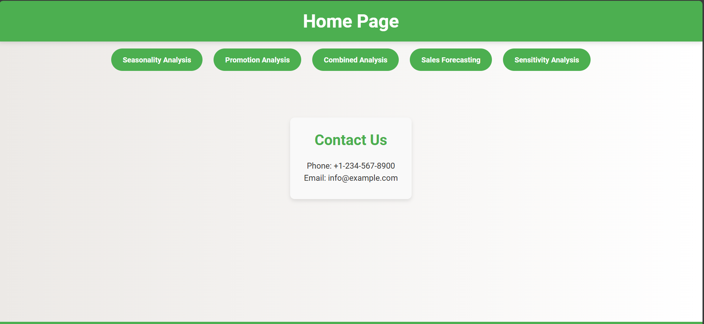
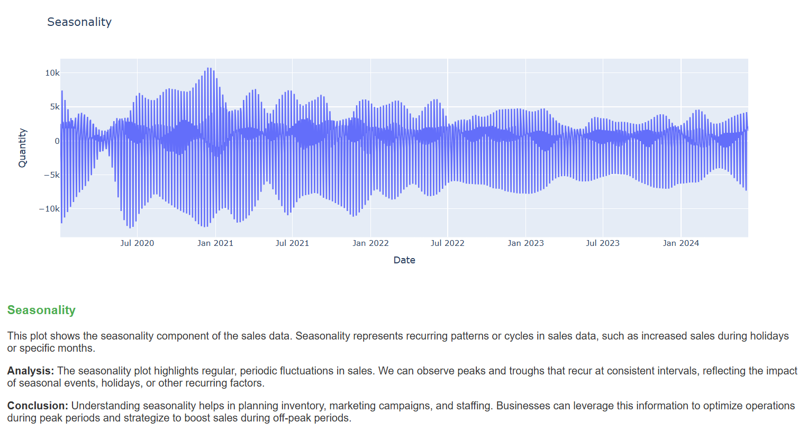
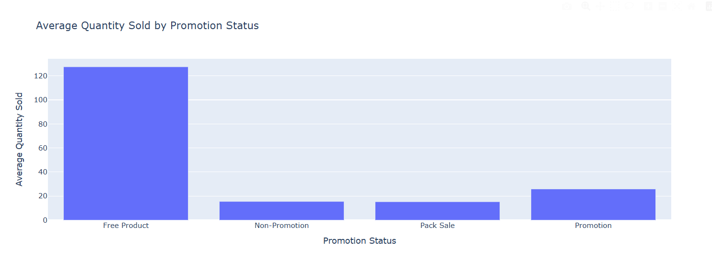
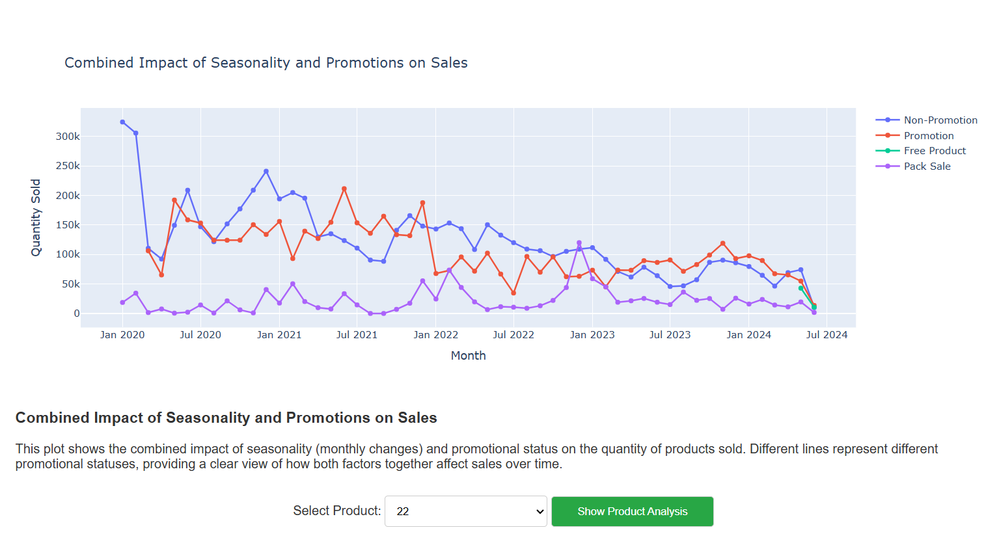
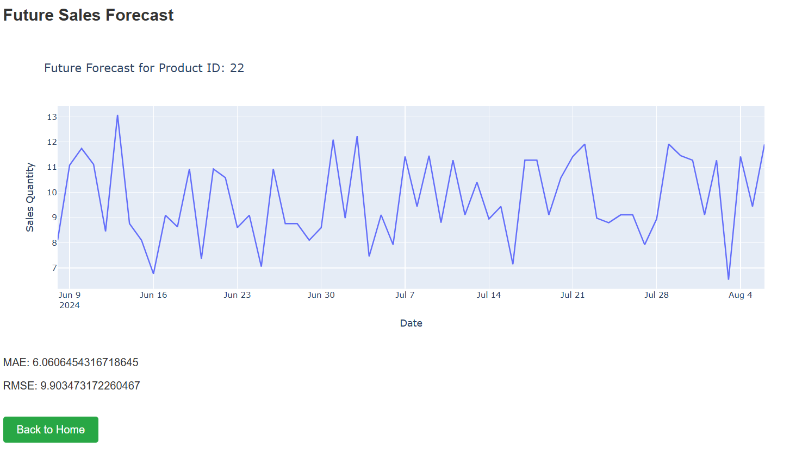
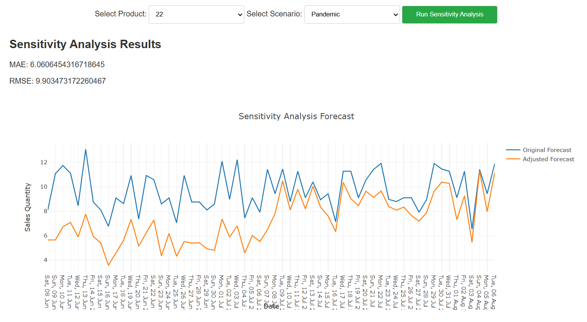

# Sales Analytics & Forecasting – Flask App

A lightweight **Flask** application for sales analysis with interactive Plotly charts, seasonal insights, promotion impact, combined trends, short-term forecasting, and sensitivity (what-if) scenarios.

> Screenshots are shown below — one image per page. Put them in `images/` with the exact names used here.

---

## Routes

| Route            | Page         | What it does |
|------------------|--------------|--------------|
| `/`              | **Home**         | Landing page with navigation to all modules. |
| `/seasonality`   | **Seasonality**  | STL decomposition (trend / seasonality / residuals) on daily sales; finds the strongest seasonal month per product/depot and explains the coefficient. |
| `/promotions`    | **Promotions**   | Compares Promotion vs Non-Promotion using a t-test; computes a promotion-impact coefficient (Promotion ÷ Non-Promotion) per product/depot. |
| `/combined`      | **Combined**     | Tracks monthly sales by status to visualize how seasonality and promotions interact over time; per-product trends by status. |
| `/forecasting`   | **Forecasting**  | Two-model ensemble (XGBoost + Linear Regression) using lags, rolling stats, holidays, and cyclical features; reports MAE/RMSE and predicts the next 60 days. |
| `/sensitivity`   | **Sensitivity**  | Scenario stress-tests (pandemic, boom, recession, launch, peak, promotion, supply issues, etc.) applied to the future forecast. |

---

## Screenshots & Page Descriptions

> Place images in a single folder: `images/`

### Home
  
Simple hub to access **Seasonality**, **Promotions**, **Combined**, **Forecasting**, and **Sensitivity**.

### Seasonality
  
Performs **STL decomposition** on daily sales to separate trend, seasonality, and residuals. Highlights the **best seasonal month** for a selected product & depot and gives a plain-English explanation of the seasonal coefficient.

### Promotions
  
Normalizes status values (Promotion / Non-Promotion / Free Product / Pack Sale), compares average quantities, and runs a **t-test** between promotion vs non-promotion. Computes a **promotion impact coefficient** by product & depot.

### Combined
  
Shows how **seasonality** and **promotions** jointly affect sales over months. Includes per-product trend lines per status when a product is selected.

### Forecasting
  
Builds an **ensemble forecast** (XGBoost + Linear Regression) with engineered features: lags, 7-day rolling mean/std, **US holidays**, and cyclical encodings for month & weekday. Reports **MAE/RMSE** and generates a **60-day** forward forecast.

### Sensitivity
  
Applies scenario multipliers to the forecast to simulate **pandemic**, **recession**, **boom**, **new product launch**, **seasonal peak**, **promotion**, **supply chain disruption**, **regulatory change**, or **competitive pressure**.

---

## Tech Stack

- **Backend:** Flask (Python 3.x)
- **Data/ML:** pandas, numpy, statsmodels (STL), scipy (t-test), scikit-learn, xgboost
- **Viz:** Plotly (interactive charts)
- **Time features:** `pandas.tseries.holiday.USFederalHolidayCalendar`

---

## Getting Started

```bash
# (Windows PowerShell) create & activate a virtual environment
python -m venv .venv
. .venv/Scripts/Activate.ps1

# install dependencies
pip install -r requirements.txt

# run
python app.py
# or (if using Flask CLI):
# flask --app app run --port 5000 --debug
